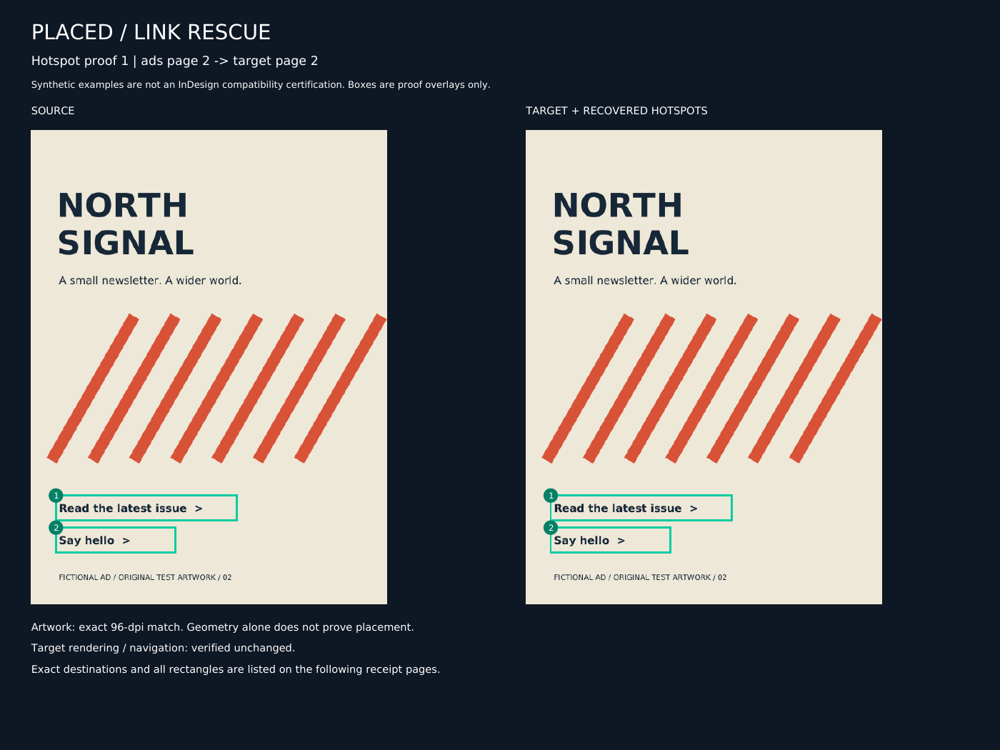

# PlacedLinkRescue

**Recover the original links. Keep the finished publication.**

An experimental local assistant skill + Python helper for hyperlinks lost when PDF pages are placed into a larger publication. It copies the original external link hotspots into an explicitly mapped, separately exported PDF, then checks that the target's artwork, existing links and navigation did not change.

[中文说明](#中文说明) · [Example proof](examples/synthetic-magazine/recovered/proof.pdf) · [Example receipt](examples/synthetic-magazine/recovered/receipt.json) · [Validation](docs/VALIDATION.md)



## Small, deliberate scope

- Original source annotations only: HTTP, HTTPS and mailto. No OCR, invented URLs, online link checking or destination visits
- Explicit SHA256-bound, 1-based source-page → target-page maps; handles reordering, editorial inserts and different document lengths
- Whole-page, 100% scale, zero-offset, unrotated, uncropped placements only
- New digital PDF, side-by-side hotspot proof and machine-readable receipt
- Complete target-document clone; existing TOC, outlines, named destinations, page labels, links and content are verified rather than replaced
- Refuses conflicts, ambiguous maps and recognized unsupported active PDF features

**This is not a general InDesign repair guarantee.** Tests use original synthetic vector and rasterized publication fixtures. No actual InDesign export or customer publication has been validated. A real export can have unsupported annotations or features, and a bad human-approved mapping can still put a link in the wrong place.

## Why a reviewed map?

Equal page sizes do not establish where artwork was placed. `exact-artwork` mode requires equal source/target rendering at 96 dpi. Re-exported fonts or rasterized artwork can fail that test even with correct placement.

For those cases, generate the proof first and inspect every hotspot. `reviewed-identity` mode accepts an explicitly reviewed placement assertion; the receipt labels it **human-reviewed, not automatically proved**. It does not infer, detect or compensate for scaling/translation. Never use it to wave away an unexplained mismatch. Target-before/after rendering and structural preservation checks remain mandatory in both modes.

## Try the original demo

Python 3.10+ and Poppler's `pdftoppm` are required. Install Poppler with your operating system's package manager (for example `brew install poppler`, or `sudo apt install poppler-utils`). Python dependencies come from PyPI; there is no server or API key.

```bash
python -m venv .venv
. .venv/bin/activate
python -m pip install -r skills/placed-link-rescue/requirements.txt

python skills/placed-link-rescue/scripts/placed_link_rescue.py repair \
  --map examples/synthetic-magazine/reviewed-map.json \
  --output-dir demo-output
```

The fictional two-page ad file maps page 2 to magazine page 2, and page 1 to magazine page 4. The five-page magazine has editorial inserts, an existing internal TOC link, three outlines, a named destination and an existing external archive link. Recovery adds three links. Open `demo-output/proof.pdf`, and use `demo-output/digital.pdf` as the new digital copy. The checked-in `recovered` directory is an already-built example.

On Windows, activate the virtual environment with `.venv\Scripts\activate` and use a trusted Poppler distribution. Windows execution has not been tested for this release.

## Use your PDFs

```bash
# Inspect original destinations and final page geometry
python skills/placed-link-rescue/scripts/placed_link_rescue.py inspect ads.pdf final.pdf

# Supply known placements; this deliberately creates an UNAPPROVED map
python skills/placed-link-rescue/scripts/placed_link_rescue.py draft-map \
  --source ads=ads.pdf --target final.pdf \
  --placement ads:2:2 --placement ads:1:4 --output map.json

# Review source + target artwork with identical numbered hotspots
python skills/placed-link-rescue/scripts/placed_link_rescue.py preview \
  --map map.json --output-dir preview

# After actual review, edit the review record in map.json, then:
python skills/placed-link-rescue/scripts/placed_link_rescue.py repair \
  --map map.json --output-dir recovered-digital
```

The review record requires `approved: true`, a reviewer and a meaningful evidence note. Keep `alignment: "exact-artwork"` unless you have actually reviewed a nonidentical re-export and confirmed identity coordinates; only then choose `"reviewed-identity"`. Input hashes changing requires a new review. All output directories must be new. [Full map and workflow reference](skills/placed-link-rescue/references/workflow.md)

## Install the assistant skill

Copy the entire `skills/placed-link-rescue` folder into your agent's skills directory, such as `~/.codex/skills/placed-link-rescue`. Install that folder's `requirements.txt` into a virtual environment and make Poppler available. The helper and references travel with the skill; it does not depend on this repository's working directory.

Example request: “Use placed-link-rescue to recover the links from these original ads into my final PDF. Here is the reviewed page map. Keep my existing TOC and give me a new digital copy with a hotspot proof.”

## What it refuses or leaves alone

- Rejects scale/offset/skew, rotation, crop changes, non-default UserUnit, geometry mismatch and ambiguous/overlapping hotspots
- Rejects forms, signed/encrypted files, JavaScript/automatic/chained/remote actions, attachments, optional-content annotations, non-Link annotations and QuadPoints
- Reports source internal links as skipped; does not move their destinations to invented pages
- Does not fetch URLs, execute actions, parse XML/XMP, change originals, replace target pages or rebuild the target TOC
- Added links are untagged. No accessibility, PDF/UA, PDF/A, print-ready, signature-preservation or malicious-PDF-sanitizer claim
- Resource bounds and renderer timeouts reduce accidents, but are not OS isolation or a security audit. Use patched tools and a sandbox for untrusted PDFs

Rendering checks are at 96 dpi using the installed Poppler version, not every viewer/resolution. Structural verification complements these pixel checks. Exact duplicate links are a no-op; a repeated run against a freshly hash-bound repaired input emits byte-identical PDF bytes. [Detailed limits](skills/placed-link-rescue/references/workflow.md#boundaries-and-errors)

## Tests and provenance

```bash
python -m pip install -r requirements-dev.txt
python -m unittest discover -s tests -v
```

The tests independently inspect the result with MuPDF, compare actual rendering with Poppler and MuPDF, verify page content/navigation/destinations, exercise malformed and adversarial inputs, and run the copied skill from outside the checkout. Optional MuPDF test dependencies have their own AGPL/commercial license; the runtime does not require them.

See [validation manifest](docs/validation-manifest.json), [AI provenance](AI_PROVENANCE.md), [research and related tools](docs/RESEARCH.md), and [MIT license](LICENSE). Link copying is established functionality. This project's original contribution is the narrow, reviewable recovery workflow and its skill, proof, receipt and refusal/preservation checks. No claim of a novel copying algorithm.

## 中文说明

PlacedLinkRescue 是一个实验性的本地 skill 和 Python 工具：把原始 PDF 中已有的外部链接点击区域，按照明确审核过的页码映射，恢复到最终出版 PDF 的新副本里。

适合：广告 PDF 被整页置入杂志后链接丢失，广告重新排序，或中间插入了编辑页面。它保留最终 PDF 的内容、已有链接、目录、书签和命名目标，并输出新数字版、点击区域对照校样和 JSON 验证记录。

使用步骤：

1. `inspect` 检查原文件和最终导出文件
2. `draft-map` 写入你提供的原始页 → 最终页映射；工具不会自动批准映射
3. `preview` 生成并检查每一处点击区域的左右对照
4. 确认是整页、100% 比例、零偏移后填写审核人和审核依据，再运行 `repair`

`exact-artwork` 要求 96 dpi 渲染完全一致。重新导出或栅格化可能导致渲染不同；只有实际审核后才可使用 `reviewed-identity`。该模式依赖人的确认，不代表工具已经自动证明对齐正确。两种模式都会强制验证最终 PDF 修复前后的内容和渲染不变。

只复制原 PDF 已有的 HTTP(S)/mailto 链接，不猜网址、不访问网址、不替换原文件、不重建目录。缩放、偏移、裁切、旋转、表单、签名、加密、JavaScript 等超出 v0 范围时会拒绝处理。原始文件的内部跳转会报告为跳过。

当前只用原创的虚构杂志、矢量和栅格化样例验证过，尚未用真实 InDesign 导出文件或客户出版物验证。新增链接没有无障碍标签；不声称满足印刷、PDF/UA 或 PDF/A 规范，也不是恶意 PDF 安全清洗器。完整步骤与限制见上方英文说明和工作流文档。
